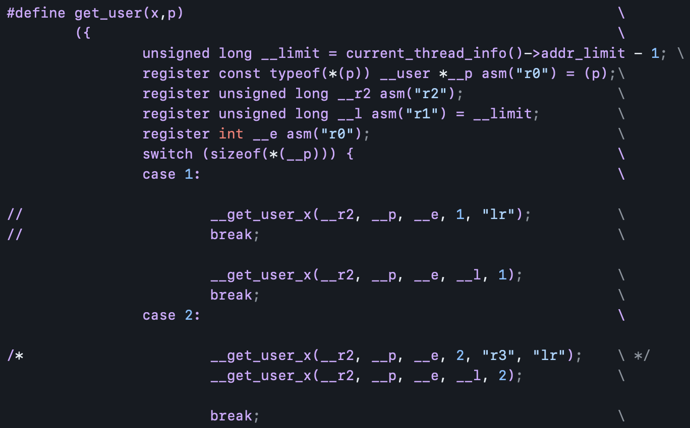
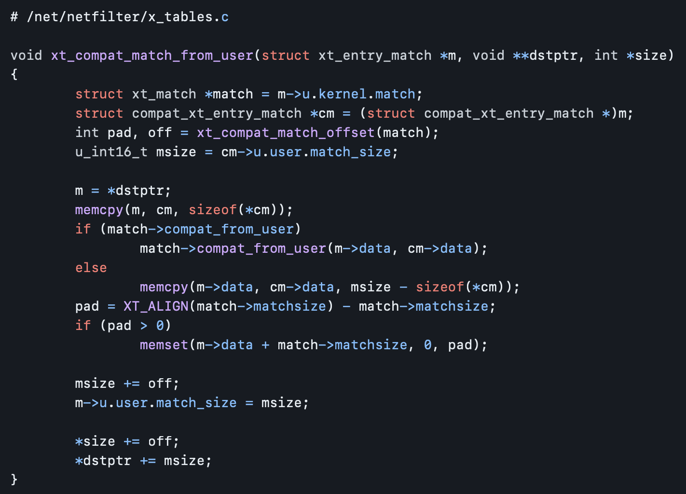
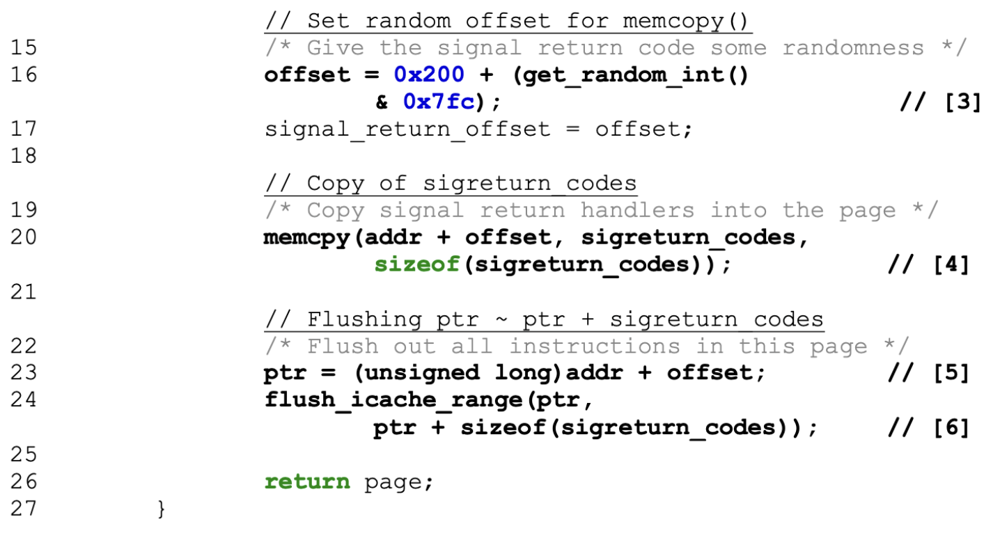

# 👣 취약점 분석 연구원이 되기 위한 발자취

<table>
  <tr>
    <th>Name</th>
    <td>이호민 (Homin Rhee)</td>
  </tr>
  <tr>
    <th>Email</th>
    <td><a href="mailto:hominlab@gmail.com">hominlab@gmail.com</a></td>
  </tr>
</table>

## Index

1. **Linux Kernel Vulnerbility Analysis Project**
   1. CVE-2013-6282 One day analysis report
   2. CVE-2021-22555 One day analysis report
   3. CVE-2021-21781 One day analysis report
2. **Standalone Project**
   1. ARM TrustZone & Samsung Knox analysis
   2. Nvidia AP25 SoC & LGE `bssq` board boot process vertify bypass

---

## Linux Kernel Vulnerbility Analysis Project

### 👥 수행 인원

| 역할           | 이름                      |
| -------------- | ------------------------- |
| Project Leader | 성공회대학교 DEBUG 이창헌 |
| Project Crew   | 성공회대학교 DEBUG 강우혁 |
| Project Crew   | 성공회대학교 DEBUG 변수영 |
| Project Crew   | 성공회대학교 DEBUG 이호민 |
| Project Crew   | 성공회대학교 DEBUG 주진호 |

### 🔈 역할 및 목표

- 개인별 특정 Linux kernel CVE에 대한 1-day 분석 보고서 작성
  - [cve.mitre.org](https://cve.mitre.org) 등 정보 제공 사이트 외 제3자의 보고서 및 분석 post를 절대 참조하지 않기
- 관심이 많은 Advanced RISC Mahcine architecture 위주 취약점 1-day 분석

---

### 1. CVE-2013-6282 One day analysis report

➡️ [hmrhee_cve-2013-6282_1.1.0-st.md](https://github.com/icaros7/1day-report/blob/main/cve-2013-6282/hmrhee_cve-2013-6282_1.1.0-st.md)

> 메모리 쓰기에 대한 주소 검증 누락으로 인한 Local Privilege Escalation

#### ⏰ 수행 기간

- **2022.09.22 - 2022.10.17** (추가 문서 가다듬기 작업 2022.11.16)

#### 📚 새롭게 배운 점

- **`copy_{to, from}_user()` 메서드와의 차이점**
  - 지원하는 데이터 형식의 차이
  - 구조체 등 다양한 형식을 지원하는 `copy_{to, from}_user()`
  - `char`, `int` 그리고 `long` 등 특정 데이터 형식만을 위해 설계된 `{get, put}_user()`
- **TLB (Translation Lookaside Buffer) 개념**
  - Userland 와 직접 연결되고 접근 제어와 메모리 변을 담당하는 캐시
  - MMU (Memory Management Unit) 으로부터 주어진 메모리 주소에 접근 가능 여부 캐싱
  - 캐싱 시 table 형태로 보관 (내부적으로 entry라 부름)
- **메모리 주소 읽기 쓰기 시 관례적으로 `setsockopt()` 사용**

#### ✅ 느낀점 및 어려웠던 점

- 직접 창의적인 Proof of Concept 를 작성 시도하는데 너무 많은 시간을 할애
  - 하지만 실패를 하여 기존의 공개된 PoC를 audit 하는 방향으로 전환
  - Linux kernel exploit 에 대한 C기반의 PoC 작성 역량 강화가 필요하다 판단
- 기존 사용했던 일부 루팅 kit이 본 취약점 기반인 것을 고려 할 때 상당한 영향력을 가진 중대 취약점임을 느낌

---

### 2. CVE-2021-22555 One day analysis report

➡️ [hmrhee_cve-2021-22555_v1.0.2.md](https://github.com/icaros7/1day-report/blob/main/cve-2021-22555/hmrhee_cve-2021-22555_v1.0.2.md)

> Heap Out-of-Bounds 로 인한 Local Privilege Escalation

#### ⏰ 수행 기간

- **2022.07.18 - 2022.07.29** (추가 문서 가다듬기 작업 2022.09.24, 2022.11.18)

#### 📚 새롭게 배운 점

- **아키텍처 별 `NULL` padding 의 필요성**
- **GCC의 `__alignof__` 매크로**
  - 반환 값으로 매개변수로 주어진 data의 정렬 필요 byte 반환
- **`xt_compat_*()` 존재 의의**
  - 단어 뜻 그대로 compat, 호환을 위해 존재
  - Netfilter 상의 추상화 라이브러리인 `xtables`의 상호 호환이 목표

#### ✅ 느낀점 및 어려웠던 점

- `netfilter`에 대해 많은 공부를 하는 계기가 되었음
- 이를 계기로 C 기반 code audit 능력이 많이 향상

---

### 3. CVE-2021-21781 One day analysis report

➡️ [hmrhee_SIGPAGE_CVE-2021-21781_v1.2.0.pdf](https://github.com/icaros7/1day-report/blob/main/cve-2021-21781/hmrhee_SIGPAGE_CVE-2021-21781_v1.2.0.pdf)

> Return-oriented Programming을 통한 초기화되지 않은 PAGE의 information leak

#### ⏰ 수행 기간

- **2022.06.21 - 2022.07.14**

#### 📚 새롭게 배운 점

- **Linux kernel의 `singal` 관리 체계**
  - 기본적으로 아키텍처 별 크기에 따라 PAGE 단위 구성
  - PAGE를 묶어 구조체 형식 관리
- **기존 지식보다 더욱 깊은 ROP에 원리**

#### ✅ 느낀점 및 어려웠던 점

- 첫 Linux kernel 취약점 1-day 분석 보고서라 전반적으로 수행에 어려움이 있었음
  - 보고서 형식, 흐름 구성 등 가능하면 나만의 틀을 구성하고 싶어 해당 부분이 어려웠음
  - PL의 주관적 판단에 의한 첨삭을 통해 나만의 보고서의 틀을 점점 갖추어 나가는 것이 무척 기뻤음
- 드라이버가 제외된 Linux kernel 그 자체에 대해 공부하는 계기가 되었음
- 실제 기기를 대상으로 진행이 어려워 QEMU 를 통해 exploit 을 재현 시도 하였으나 실패
  - KGDB 상에서 `Recursive entry to debugger` 문제

---

---

## Standalone Project

### 1. ARM TrustZone & Samsung Knox analysis

### 🔈 프로젝트 목표

- ARM TrustZone 하드웨어 보안 기술에 대한 이해
- Samsung Knox 소프트웨어 보안 기술에 대한 이해

#### ⏰ 수행 기간

- **2023.01.15 - Now**

#### 📚 새롭게 배운 점

- **ARM TrustZone 개념 이해**
- **SM-G920 Android 8.1 탑제 Knox의 MITM 공격 분석 사례 논문 번역 및 정리** (진행중)

#### ✅ 느낀점 및 어려웠던 점

- 아직도 진행 중인 미완성 상태
- Knox 관련 자료가 많지 않아 공격 사례 기반 분석인 것이 아쉬움

---

### 2. Nvidia AP25 SoC & LGE `bssq` board boot process vertify bypass

### 🔈 프로젝트 목표

- 부트 과정 중 무결성 검증 우회

#### ⏰ 수행 기간

- **2013.01.18 - 2013.02.28**

#### 📚 새롭게 배운 점

- 전반적인 Nvidia Tegra2 AP25 SoC 부트 과정
- IDA 도구에 대한 기본적 이해
- 기본적인 그래픽 출력 과정 (부트 그래픽 수정 등)

#### ✅ 느낀점 및 어려웠던 점

- 당시 발자취 및 버전 관리의 중요성의 부재로 인한 기록 미비
- 인생 첫 리버스 엔지니어링 실습 이라 상당한 지식 습득을 요했음
- 이를 계기로 ARM 기기에 대한 진로를 확정 지음
- 더 높은 완성도의 제 3자의 결과물이 발표로 인해 중단

